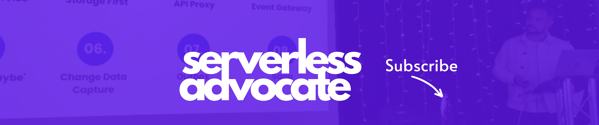

<h1 align="center">Hey, I'm Lee, a Serverless Advocate, AWS Community Builder, Cloud Architect, Mentor and Blogger 🚀</h1>
<h3 align="center">A passion for all things Serverless on AWS - Go follow me using the links below</h3>

  

  

- 💬 Ask me about **Serverless on AWS**

- 📫 How to reach me **https://linktr.ee/leegilmore**

- 📝 I regularly write articles on [https://leejamesgilmore.medium.com/](https://leejamesgilmore.medium.com/)

- 🌱 I’m currently learning **Kafka** and **always focusing on AWS skills**

- 👯 I’m looking to collaborate on **Serverless and Node/TypeScript open source projects**

- 📄 Know about my experiences [https://www.linkedin.com/in/lee-james-gilmore/](https://www.linkedin.com/in/lee-james-gilmore/)

<h3 align="left">Connect with me:</h3>

<h3 align="left">Languages and Tools:</h3>

                           

<h3 align="left">Support:</h3>

If you enjoy my regular articles and mentorship please think about supporting me below

  
